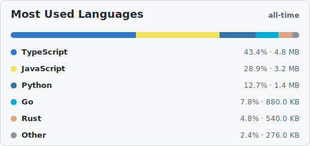
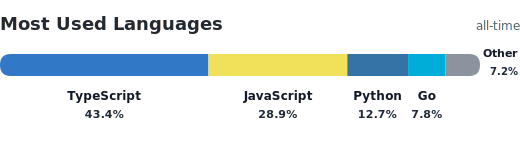
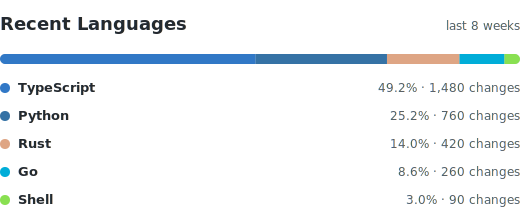
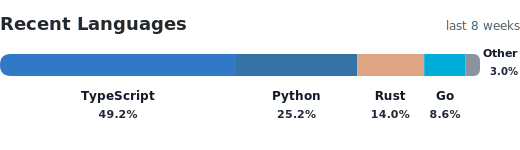

# GitStats

Generate configurable GitHub language stats SVGs for profile READMEs.

GitStats is a configurable stats viewer for language usage and recent language activity:

- Choose the data timeframe: `all-time` language bytes or a recent number of weeks.
- Choose the display style: `normal` with a list, or `compact` with a labeled bar.
- Hide languages, group small entries into `Other`, cap the number of displayed rows, and control value display from README config blocks.
- Generated SVGs include internal horizontal padding and a subtle card background that remains distinct from GitHub's page background in light and dark mode.

> [!IMPORTANT]
> GitHub may cache README images for a short while after the workflow updates the SVG files. If the raw SVG file is correct but the README still shows the old card, please wait a bit and refresh later.

## Quick Setup

This default setup generates two cards:

- Most Used Languages, normal style, all-time bytes.
- Recent Languages, compact style, last 8 weeks of changes.

Add this workflow to the repository where the SVG files should be committed. For a GitHub profile README, that is usually `YOUR_USERNAME/YOUR_USERNAME`.

GitStats is published as a reusable GitHub Action, but users still need to add a workflow manually. The workflow decides when the action runs and grants write permission to the current repository. GitStats then reads the README config blocks, generates the SVG files, updates the managed display section, and commits changed files automatically.

```yaml
name: GitStats

on:
  workflow_dispatch:
  push:
    branches:
      - main
    paths-ignore:
      - "profile/*.svg"

jobs:
  languages:
    runs-on: ubuntu-latest
    permissions:
      contents: write
    steps:
      - uses: actions/checkout@v6

      - name: Generate language stats
        uses: One-Simon/GitStats@main
        with:
          token: ${{ secrets.GITSTATS_TOKEN }}
          username: YOUR_USERNAME
```

Then add the panel settings and display placeholder to your `README.md`.

The omitted settings below use the defaults, including `hide-languages: HTML,CSS,JSON`, `grouping: true`, and `max-languages: 10`.
The block names become the SVG file names, so these two examples generate `profile/most-used.svg` and `profile/recent.svg`.

Most Used Languages:

```md
<!-- gitstats:config most-used
style: normal
timeframe: all-time
gitstats:config -->
```

Recent Languages:

```md
<!-- gitstats:config recent
style: compact
timeframe: 8
gitstats:config -->
```

Managed display section:

```md
<div align="center">
<!-- gitstats:display -->
<!-- gitstats:display -->
</div>
```

GitStats rewrites the content between the display markers with the generated image tags. You do not need to add SVG paths or `` tags yourself. The surrounding `<div>` is yours, so you can center the cards, place them in a table, or use any other README layout GitHub supports.

For split layouts, add a config block name to the display markers. A named display block renders only that one named card. Config block names used for display sections must be unique:

```md
<div align="center">
<!-- gitstats:display most-used -->
<!-- gitstats:display most-used -->
</div>
```

Run the workflow once from the Actions tab. After the first successful run, the generated SVGs will be committed and displayed in your README.

## Configuration

GitStats reads every `gitstats:config` block in your README and generates one SVG for each block.

Only set the values you want to change. Omitted settings use the defaults below.
Config blocks shown inside fenced code examples are ignored.
Add display sections with paired `<!-- gitstats:display -->` markers. An unnamed display section renders all generated cards in config order. A named display section, such as `<!-- gitstats:display most-used -->`, renders only the matching named config block. GitStats rewrites only the content between the markers, and it injects only image tags plus spacing. Put the markers inside the README layout you want, such as `<div align="center">`. Do not edit the generated content between the markers; change the config blocks instead and rerun the workflow.

```md
<!-- gitstats:config example-name
style: normal
timeframe: all-time
gitstats:config -->
```

Named blocks write to `profile/{name}.svg`. For example, `<!-- gitstats:config most-used` writes `profile/most-used.svg`, and a matching `<!-- gitstats:display most-used -->` section displays that card.

Unnamed blocks are also supported. GitStats derives names from the settings, such as `profile/GitStats-MostUsed-normal.svg` or `profile/GitStats-Recent8Weeks-compact.svg`. If multiple blocks resolve to the same path, GitStats appends `-2`, `-3`, and so on.

When you add, remove, rename, or reorder config blocks, rerun the workflow. GitStats regenerates the SVGs and updates the managed display section automatically when `commit: true`.

| Setting | Default | Description |
| --- | --- | --- |
| `title` | Automatic | Optional card title override. Defaults to `Most Used Languages` for `all-time`, or `Recent Languages` for numbered timeframes. |
| `style` | `normal` | `normal` renders the full card with a list. `compact` renders a thicker labeled bar. |
| `timeframe` | `all-time` | `all-time` uses GitHub language bytes. A number, such as `8`, uses recent commit changes from that many weeks. |
| `show-values` | `true` | Shows byte or change totals in the normal renderer. Compact always shows percentages only. |
| `grouping` | `true` | Groups the smallest languages into `Other` until the bucket is near 5%. |
| `max-languages` | `10` | Maximum number of displayed entries, including `Other`. Overflow languages are grouped into `Other`. |
| `hide-languages` | `HTML,CSS,JSON` | Comma-separated languages to exclude after loading all detected languages. |
| `include-forks` | `false` | Includes forked repositories. |
| `include-archived` | `false` | Includes archived repositories. |
| `include-profile-repo` | `false` | Includes the `username/username` profile repository. |
| `affiliation` | `owner` | Repository affiliation passed to GitHub. Use `owner,collaborator,organization_member` for broader access. |
| `visibility` | `all` | Repository visibility passed to GitHub. |
| `display-width` | `100%` | Width attribute for this card's generated `` tag inside the managed display section. |
| `display-alt` | Automatic | Alt text for this card's generated `` tag inside the managed display section. |

The subtitle is always generated from `timeframe`: `all-time` for all-time renders, or `last N weeks` for numbered timeframes.

Grouping is applied after hidden languages are removed. When `grouping: true`, GitStats groups the smallest languages into `Other` until that bucket is close to 5%, preferring a smaller bucket over pulling in a language that would push `Other` above 5.5%. If there are still more entries than `max-languages`, the lowest remaining entries are also merged into `Other`.

## Configuration Examples

These are example configurations for the same stats viewer. Mix `style`, `timeframe`, and the other settings however you want.

### All-Time, Normal

```md
<!-- gitstats:config all-time-normal
style: normal
timeframe: all-time
gitstats:config -->
```

<p align="center">
  
</p>

### All-Time, Compact

```md
<!-- gitstats:config all-time-compact
style: compact
timeframe: all-time
gitstats:config -->
```

<p align="center">
  
</p>

### Recent, Normal

```md
<!-- gitstats:config recent-normal
style: normal
timeframe: 8
gitstats:config -->
```

<p align="center">
  
</p>

### Recent, Compact

```md
<!-- gitstats:config recent-compact
style: compact
timeframe: 8
gitstats:config -->
```

<p align="center">
  
</p>

## Action Inputs

README config blocks drive SVG generation. Workflow inputs provide global defaults and automation behavior.

| Input | Default | Description |
| --- | --- | --- |
| `token` | Required | GitHub token used to read repositories, language data, and recent commit data. |
| `username` | Repository owner | GitHub username to generate stats for. |
| `readme-config` | `README.md` | README path containing GitStats config blocks. |
| `commit` | `true` | Commit and push changed generated SVGs and README display updates using the workflow checkout credentials. |
| `max-languages` | `10` | Maximum number of displayed entries, including `Other`. |
| `grouping` | `true` | Group the smallest languages into `Other` until the bucket is near 5%. |
| `hide-languages` | `HTML,CSS,JSON` | Languages to exclude after loading all detected languages. |
| `include-forks` | `false` | Include forked repositories. |
| `include-archived` | `false` | Include archived repositories. |
| `include-profile-repo` | `false` | Include the `username/username` profile repository. |
| `affiliation` | `owner` | Repository affiliation passed to GitHub. |
| `visibility` | `all` | Repository visibility passed to GitHub. |
| `title` | Automatic | Global card title fallback. README config blocks can override it per card. |
| `timeframe` | `all-time` | `all-time` for language bytes, or a number of weeks for recent changes. |
| `style` | `normal` | Rendering style. |
| `show-values` | `true` | Show byte or change totals in the normal renderer. |
| `user-agent` | `GitStats-language-card` | User-Agent used for GitHub API requests. |

## Token Setup

GitStats needs a Personal Access Token because the default `GITHUB_TOKEN` only has access to the repository running the workflow.

Recommended secret name:

```text
GITSTATS_TOKEN
```

For classic Personal Access Tokens:

```text
repo
read:user
```

For fine-grained Personal Access Tokens:

- Set **Repository access** to the repositories you want included, or **All repositories**.
- Set **Repository permissions -> Metadata** to **Read-only**.
- For recent renders such as `timeframe: 8`, also set **Repository permissions -> Contents** to **Read-only**.
- If the token is scoped to an organization with SSO, authorize the token for that organization.

## How It Works

1. Lists repositories visible to the token.
2. Filters repositories by owner, forks, archived status, and profile repository settings.
3. Chooses the metric from `timeframe`.
4. For `timeframe: all-time`, reads GitHub language byte totals.
5. For a numbered timeframe, reads commits since that many weeks ago and aggregates changed files by language.
6. Applies `hide-languages`, dynamic grouping, and `max-languages`.
7. Renders one SVG for every README config block.
8. Rewrites the managed README display section with matching image tags and spacing.
9. Commits changed generated SVGs and README display updates when `commit: true`.

## Troubleshooting

### The workflow succeeded, but the README still shows the old card

GitHub caches images rendered inside READMEs. Check the SVG file directly in the repository, for example `profile/most-used.svg`. If that raw file is updated, the workflow worked and the README image cache should catch up after a little while.

### The workflow fails with `API rate limit exceeded`

GitStats reads repository, language, and commit data through the GitHub API. Wait until the rate limit resets, then rerun the workflow from the Actions tab. Recent cards can use more requests than all-time cards because they inspect commits and changed files inside the selected timeframe.

### The card does not use my README config

Make sure the workflow uses `readme-config: README.md` or leaves that input at its default. Config blocks inside fenced code examples are ignored, so active blocks should live directly in the README body.

### The workflow cannot find a display block

Add paired `<!-- gitstats:display -->` markers to your README. GitStats needs those markers to know where it may write the generated image HTML. If you use a named display block, make sure the name matches a named `gitstats:config` block.

## Notes

- All-time numbers are GitHub language byte counts, not lines of code.
- Recent numbers are commit file change counts, usually additions plus deletions. They show activity, not how much code exists in that language.
- SVGs are vector graphics. Use `display-width` to control the generated image width, and use layout HTML outside the display markers for positioning.
- Recent language detection is based on changed file paths and extensions.
- Private repository names and source code are not written to the SVG.
- Generated SVGs are public if committed to a public repository.
- Automatic commits use the workflow `GITHUB_TOKEN` from `actions/checkout`, not the stats token.
- GitStats only rewrites content between paired `gitstats:display` markers. Keep layout HTML outside those markers.

## License

MIT
